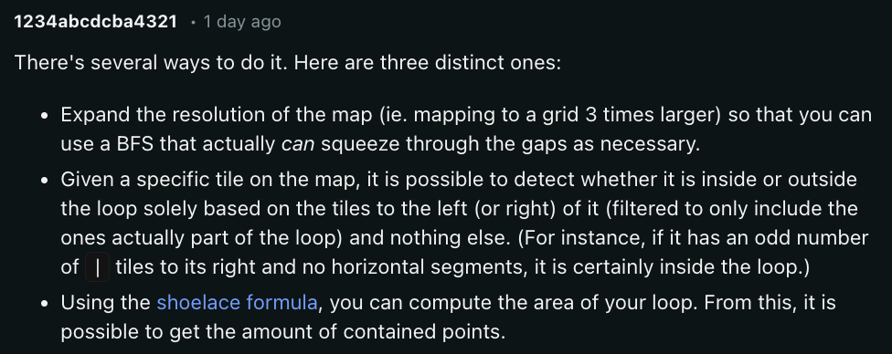

https://adventofcode.com/2023/day/10

[🌟 Day 10 🌟](https://adventofcode.com/2023/day/10)


Not sure if the challenge today was actually harder or if my brain was 😶‍🌫️ 

Oh myyyyy, laughing, fun and playing jackbox.tv tshirt game until 3am, does not make for a fresh brain at 6am. So bear with me! 


> As you stop to admire some metal grass...


#### Thinking process


Part 1: 

- (prequel) create the grid
- Find S and start there.
- One can find the S pipe shape by checking the neighbours.
- Then I travelled both ways counting the steps in one direction all the way, and then from s again in the other direction, but only until my current steps were the same or bigger than the step count coming the other way, meaning I've hit the furtheres point. 


Random bits:

```python
steps = {"n" : (-1, 0), "s": (+1, 0), "w": (0, -1), "e": (0, +1)}
opposites = {"n" : "s", "s": "n", "w": "e", "e": "w"}
directions = {
  "|" :"ns",
  "-" :"ew",
  "L" : "ne",
  "J" : "nw",
  "7" : "sw",
  "F" : "se",
  "S" : "nsew", # I think I didn't need the last two
  "." : "."
}
```
- I mapped the pipeshapes to the nesw (up,right,down,left) directions in a dictionary, as that helped me with the steps I needed to take (as in if I came from the north, and had a sw pipe, it meant that the s would pair with the n (based on the opposites dictionary), and w would take me to the next step). 
- Then I did the opposite mapping too, because I was sleepy haha.
- When working with grids, I like to define my steps as tuples. It helps me keep track of the kind of moves I can and should be doing. And makes it really easy to update the y and x coordinates as each correspond to an element of the touple pair.
```
y, x = y + steps[dir][0], x + steps[dir][1]
```


Part 2: 
- ok we have the grid with the pipes from part 1.
- my first idea was to travel across a line, and for each first | start the count and when i find the next | i add the count to the total count and so on. (Remember this.... and if you don't want to read my messy tries, you can just jump to the last line.) 
- but something wasn't right.
- so I figured I could trasverse diagonally, down-right and up-left, and define if it's a enclosed point based on the neighbours (if your left neighbour is enclosed from the right and you are enclosed from above, you are enclosed in the down-right transversal), but of course those sneaky loopy pipes
- or maybe errors, who knows, so I figured I'll split the transversal out (up, right, down, left) to make sure I don't miss anything. 
- my results grid was holding a list of 4 values [0, 0, 1, 0] for each grid point, each list holding an "is enclosed" mapping to a direction and if all 4 were 1 it meant the value was enclosed.
- but something wasn't right.
- but my [1, 0, 0, 1] lists seemed somewhat what I expected and it was just a couple values that weren't right, so I figured I could "infect" the neighbours that still thought they were enclosed. 
- remember that 3 hours of sleep brain, even if it was fresh and sparkly I would not be sure I'd do all this without mini bugs. But debugging all this, hmmm. Anyways,
- something wasn't right.....
- so then I went for a breather and a bit of support (read more down below), and this line tipped me off: "Given a specific tile on the map, it is possible to detect whether it is inside or outside the loop solely based on the tiles to the left (or right) of it (filtered to only include the ones actually part of the loop) and nothing else. (For instance, if it has an odd number of | tiles to its right and no horizontal segments, it is certainly inside the loop.)", basically I was on the right track with my first idea. But | are not the only horizontal tiles, are they?
- (Back to the first idea), but this time I realized that sideways pipes are not only | but also a combination of L7 or FJ (with any number of - in between). So just ran down my lines, while keeping track of the number of "upright" pipes, and counting the points when the conditions were right (aka odd number of pipes, which meant that we were inside).


Uffff
#### Issues

🤷‍♀️


#### Things I thought about afterwards:


Today, the thinking afterwards is not about the code but actually, thinking itself, and what AoC is about, in 2 parts:
- sharpness of brain and problem solving capacities
- The joys of community and codes of behaviour

##### sharpness of brain and problem solving capacities

So back to 6am with 3h sleep. 

I didn't notice "thinking" being any harder directly, like I felt I was alright. But I did notice I found it super hard to reuse variables, like if I needed something, I just made a new one. I think I made like 5 different grids, where they could have been one or two. It was hard to keep in mind what I had done already, or what variables are and what they contain, or how to change them slightly so that they can adapt to my newly understood requirements.

And then probably making little errors is much easier and following little brain/code hints and pushing through to a solution is also a little harder. 

Like what ended up being my solution at the end, was almost what I was after first, but I didn't figure out what I was missing or believe that I could debug it, and going to a new potential solution was just easier. (That then also didn't work fully, probably hiding in itself a bug or two, that my brain was unable to catch).

But it's interesting how the brain is still like "I am totally here, dude, trust me", but it's not true. 

I wonder if perseverance is also affected (and yes it probably is).

---

##### The joys of community and codes of behaviour


This year I am sharing my AoC hype with the Le Wagon [^bignote] community, and this really makes a difference. I had an AoC partner in 2020, but to have a whole AoC family <3, wow, to be able to share excitment, desperation, solutions and jokes it's what makes life meaningful.[^2] 

One question that kept popping up in the various chats ovet the last days was what is cheating (there are prizes and street cred on the line, I hear!). And my answer so far has been:
1. give it a solid nudge
2. take a break and reread instructions (somewhere along the previous and next step)
3. give it another solid nudge (like try around various solutions, debug etc)
4. read some implementation strategies
5. (and potentially) look into other people's code for inspiration (to see how people have solved it)
6. (and maybe) implement code by looking back at someone's code


I have never used these last 2 for AoC, even when I do previous years challenges. 

There is another step (I'd insert somewhere alongside/between 2 and 4 inclusive), that thanks to being part of a community there is also the talking and debugging together element. 
Which can happen early on, especially fun when both people have no idea what's going on or what should be done. Or all the way on the other end when it's all done: with code sharing and laughter at the endles for loops or tips on what could have been improved.

Yesterday, I did a solid on step 1., (first with the side lines, then with diagonal transversal, than with the 4.direction transversal, then adding the "infection" step to account for those that are hugged by pipes but out in the open). Each time the value kind of about right but just out of reach, so probably some off 1 error or some other thing.


At some point I went on Reddit to find ideas (btw the memes are 👌) and found this [thread](https://www.reddit.com/r/adventofcode/comments/18ey1s7/2023_day_10_part_2_stumped_on_how_to_approach_this/). I looked at the first message, and the 2nd point strung a cord with me.



I went back to my code, refreshed, and was able to solve the challenge with a few swift steps after I figured out which pairs make for a side, and how to deal with the - in between.

-----

But soon I also started wondering about that question! What is cheating? Is this cheating? I am on some leaderboards yeah, but I wasn't aiming for the top (there are actually some people who make it to the top100 world leaderboard wow), but I still wondered if it is inappropriate? I had a niggly feeling that something is not right. 

I didn't know what to think because I was advocating that this kind of behaviour is ok, and AoC is for learning etcetc. days before I resorted to it myself, I am always happy to chat and give hints, and I had given it 3 hours or so already. According to my "moral values" I was alright. So why was this voice still there?


I created that list above, going by how i behaved over the last few years (when I was alone) and even when I do previous years challenges for missing stars I still adhere to those steps. Like after a solid effort and if I have absolutey no idea I check what strategies people came up with (no code). Which still takes a while to implement. Like hours sometimes until I figure what it actually means. I remember being on day 19 or 20 in 2020, at some point my AoC mate mentioned the chinese reminder theorem, I had never heard of no chinise reminder theorem for example, it's not like I need to invent math again.

But it is interesting, that because there is a place where my actions influence "others" in some sense (I guess this leaderboard) it adds a different kind of pressure and (potentially) expectations of myself. MAYBE?

After a bit more of thinking, and reiteration of my own advice to other people - as in that it's about learning, and having fun and look at those steps above etc - I figured my sadness came from the fact that I felt like I didn't actually give it a good enough shot. Instead of taking a step back and looking at my problem and what I had figured out already, maybe my tired brain said: "go somewhere safe, find help". And so I might have not figured it out fully  "on my own". I had taken from myself a tiny bit of the "maxy AoC rush".


Back to reality, all these words are so hillarious, when I actually remember that there are some people on some of these leaderboards that copy paste solutions (like a couple seconds between part1 part2 - along with other sus hints - lol, people what are you doing! Like hard to deny actual, so obvious it's funny, cheating). 

I am sorry haha, but you are missing out on all the fun 😅

And it's not that I even care about the leaderboards that much (let's go Brussels, I believe in us!), but it's interesting to see how different people can have such different experiences, behaviours and reactions based on a similar set of incentives.


And this is why I love Advent of Code, full blown existential crisies served in a 6am sandwich. 

Can't wait for tomorrow.
❤️‍🔥🌟❤️‍🔥🌟❤️‍🔥


----

[^bignote]: I did the data bootcamp over last winter in Brussels, that I wholeheartedly recommend. I really enjoyed the way the material was laid out, the challenges created to internalize information, the support structure and the incentives to collaborate with my course mates (which were awesome as well #1109forever). I've been around ed-tech and worked both in tech and ed-tech for a few years now, and I still felt I was able to gain from this experience so much. 

There is always talk of alumni networks, and although I haven't relied on it professionally (yet?), I definitely am socially, we still meet with my Brusselenian mates, and now  this Advent of Code joy means so much. Anyways back to it.

[^2] Shoutout to the readers! A few of you mentioned you enjoyed reading these. I was on the fence if I should post the AoC challenges at all (I haven't done it ever yet), and those cheers are really motivational. Thanks a lot.