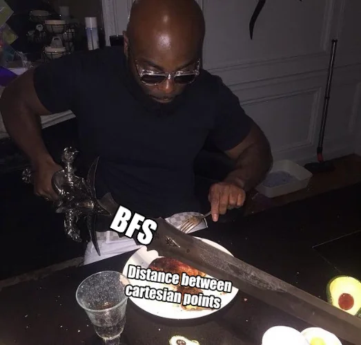

https://adventofcode.com/2023/day/11

[🌟 Day 11 🌟](https://adventofcode.com/2023/day/11)

Wohooo, not exactly unit testing, but I tested a function with different sinlge inputs to see where the error was (and found it)...

#### Thinking process

Ahhhh! The distance between two points.

(and not the shortest distance between any two points without re using the points, like yeah how did I come up with this challenge??? that I spent some solid time thinking about and figured maybe I start somewhere and then we'll figure how to order them and etcetc). 

Anyways, luckily, it was no travelling salesman just some guy shopping up and down the streets of New York (or more like the expanding universe).

So, I first dove into some implementation of breadth first search.

Oblig meme:

[Meme source](https://www.reddit.com/r/adventofcode/comments/18foltz/comment/kcwh1s7/)

but luckily I realized eventually that it's actually (just) the distance between all the various points pair combinations.

Part1: 
- when I created the map I just added the extra line into the grid.
- got the coordinates of all the points, 
- got all the pair combinations of all the points
- calculated the distance by summing (the absolutes of) x1-x2 & y1-y2.

Part2: 

The main differences were: 
- instead of inserting the empty lines and columns, I kept a list of their indexes.
- and so while computing the distance, I multiplied the amount of expandable_points enclosed in the range between the two points.

#### Issues
I was doing my ranges x1->x2 y1->y2, which was a problem if the first was bigger than the second, it would not do anything. So I stored the smaller and bigger of each pair into variables.

#### Things I thought about afterwards:

Another thing that came up in today's chats is that I like to parse all the data, and store it into a couple clean variables that contain all our info, to then play around with those variables. Only if the task is very simple I start do some computing there too.

It's interesting how on the days where there is a lot of fiddling and false solution starts and paths, there is also quite a lot of deleted code that has no space in the final implementation. Sometimes it's also just a rewrite, with a fresher mind and a larger understanding of what the task actually is. 

----

AoC is definitely starting to hit hard. The early mornings, the adrenaline, the emotions. It's really increadible what universe a couple of silly elves in trouble can create.

🎄

