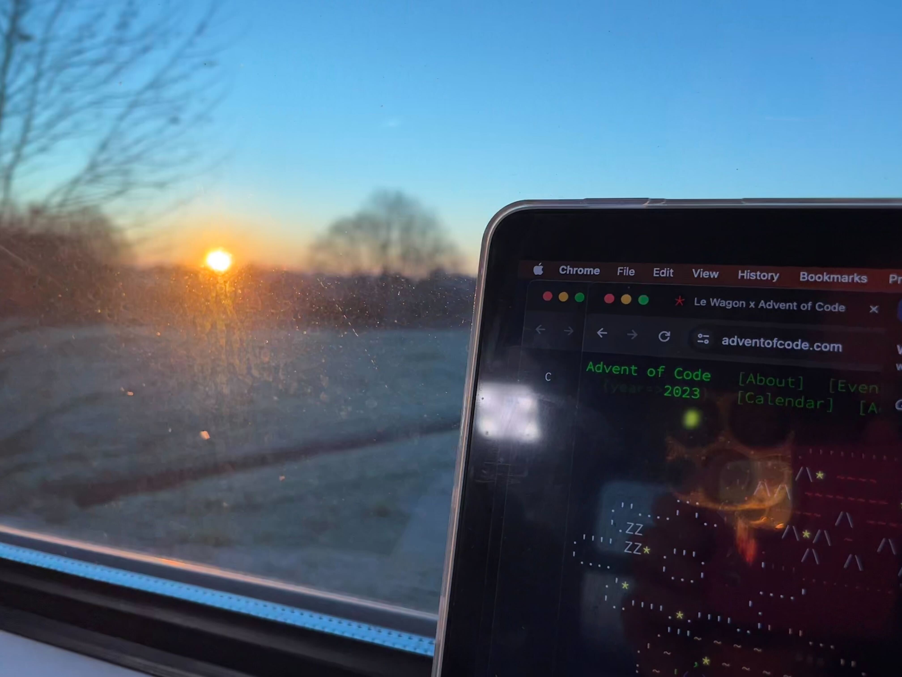

https://adventofcode.com/2023/day/16

[🌟 Day 16 🌟](https://adventofcode.com/2023/day/16)


I was running to catch a board a train at 6am, so only started a few mins late, but it only added to the adrenaline.



#### Thinking process
Actually, I wrote most of the helper dictionaries as the first step. 
Basically translations from directions to steps, and new directions from the combo of old direction plus pipe. It also gave my brain 

```python
dirs = {"n": (-1, 0), 
        "e": (0, 1), 
        "s": (1, 0),
        "w": (0,-1)}

# and like so for all the other directions.
mirrors_w = {
  ".": "w",
  "|": "ns", 
  "\\": "n", 
  "-" : "w",
  "/" : "s"
}
```

Part 1
- created the grid with the input data
- created an energy grid with zeros
- created a visited grid with a dictionary on each point of which direction has visited it yet.
- created a queue to hold points and directions I still needed to check. (Which at first was just the starting point.) The test data worked in my first implementation, but there was too much branching and i got a recursion too deep error, so I decided to just travel one way first, and keep a queue of paths not taken (start point, direction). This made it possible to complete the journey pretty fast! And [spoiler] set me up well for part 2.
- The travelling part: 
    - if I am falling off the grid or if I visited this spot from this direction, that's it.
    - set the spot as visited and ENERGIZED
    - if it hits a split mirror, add one of the paths into the remember queue, 
    - find the next step of the first (or only) directio (by adding the step values to the y and x), and travel there then
- return the number the coordinates in the energy grid that were ENERGIZED!

Part 2

I created all the possible start points (point, direction) and just ran them on part 1. Making sure I reset all the values (energy, visited, total) between each loop.


#### Issues
I made a little error in one of my dictionaries hehehe not hehe. In the dirs one actually, i just didn't have the right step into a certain direction. There were a lot of little places one could trip up today, I think, so I am happy I didn't (maybe one or two).

Also it's pretty fun to see, that I can write quite a lot of code and then run it and usually it does what I want (maybe a typo or missing parenthesis here or there). It's nice to see that my programming brain can hold in it a bigger chunk of a program, at 6am, under high levels of adrenaline and silly rush.

Having said that, my grids and grid-like value holding structures were all over the place. I wasn't sure which grid was updating where, so I just made a bunch of global variables and was deleting/rewriting them in a more places. 

Also there is a lot of fear of weekend tasks (in the Le Wagon community but reddit too), so it's nice to be able to breathe in relief, however tomorrow is now even more scary! And I have even less time 😱

#### Things I thought about afterwards: