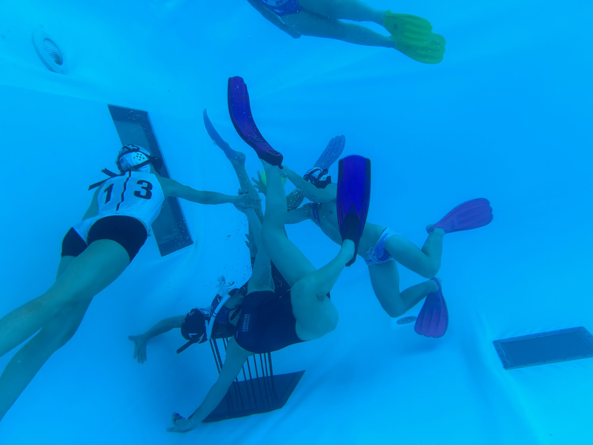
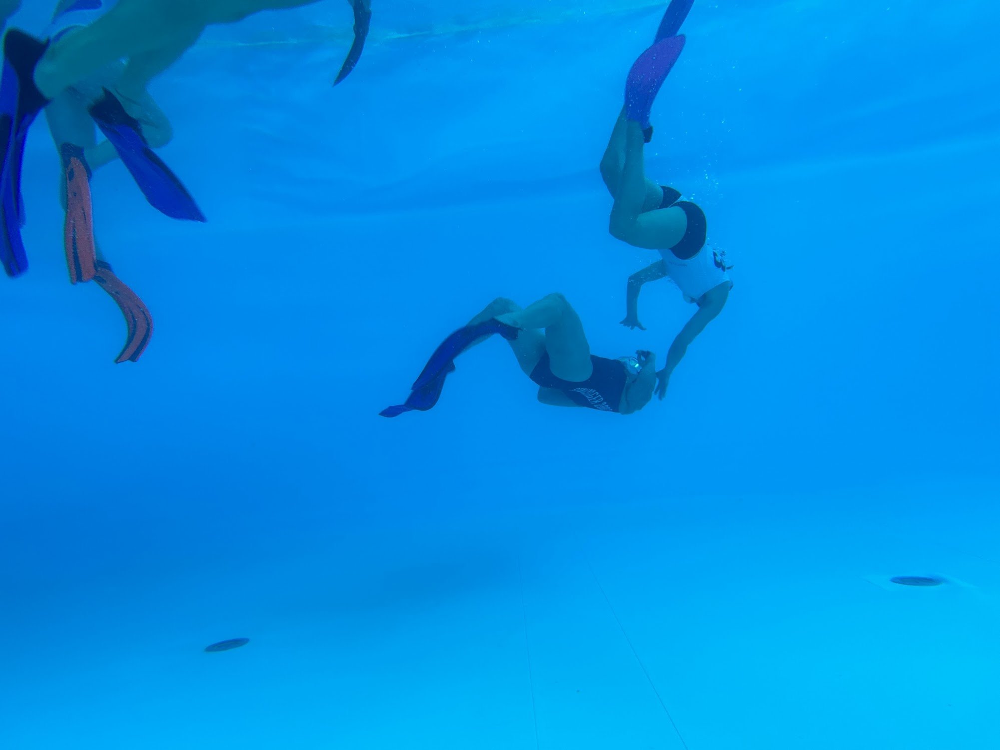
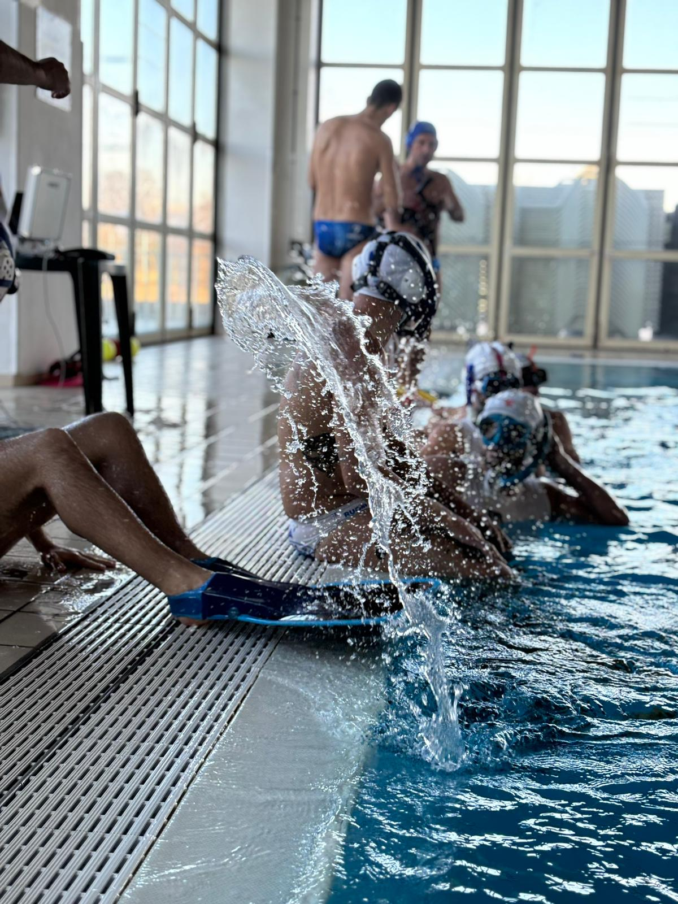

https://adventofcode.com/2023/day/17

[🌟 Day 17 🌟](https://adventofcode.com/2023/day/17)

Underwater rugby training camp weekend! 

I had 1.30h before we were going to start making our way to the pool. I was hiding behind a table again not to wake my teammates up and I was sleepy again because we rugby we party (shoutout to the valtellina crew and The Balenara delle ortiche, wow what a place). If you asked me "do I party?", I would tell you I love to party but it's rare. I don't know if 3 times in 17 days is rare, and sure, it's December, but maybe my perception is warped too.

🤣

Anyways, a toughie today, and it was even tougher because it was hard to focus, when surrounded by people and chats, and also, most of the day, water. 

I managed to get the first star before actually going into the water (thank to the Le Wagon crew for some debugging help), and then I had to stop to get back into it when I was on the train back home. 

#### Thinking process


The time of DJIKSTRA HAS ARRIVED.
I had a quick google of how to do djikstra (I knew it had to do with weights, and queues, but wanted to have some hand holding). Anyways one of the top stackoverflow answers had a nice set of pseudocody instructions:

```python
# create a heap or priority queue
# place the starting node in the heap
# while the heap contains items:
#    pop top of heap
#    for each element blabla bla [that's how far I got]
```

Also with the trips around maps I know there is often something about keeping track of visited spots. Remember this bit, because that's where I tripped up. 


Part 1:

- I used a heap, because their left most element is "the smallest", so by putting tuples with the heat loss on index 0, let me have a data structure that had the shortest paths so far on the leftest side of the heap.

This is what the tuples contained:
```python
heapq.heappush(paths, (0, 0, 0, 0, "s")) # heat_loss, y, x, step, dir
```


Often with grid / motion in directions I like to create some helper datastructure/ instructions first. The typical one is the steps:

```python
steps = {
  "n":(-1,0),
  "s":(1,0),
  "e": (0,1),
  "w":(0,-1)
}

```

I am particularly proud of this one, which I used to either get all the values, or the obligatory turn (afte the 3rd step) by skipping `dirs[dir][0]` which meant to go in the same direction

```python
# can't go back
dirs  = {
  "n":"new",
  "s":"sew",
  "e":"ens",
  "w":"wns"
}
```

I also had an is_valid function that would check if the next point was on the grid, if it had been visited already.

And so I travelled along the heap (popping the leftmost element), and adding all the possible new locations to the heap, adding the heat loss on each step, updating the x & y values, along with the direction. By adding to the heap the order was being taken care of by itself.

And when I arrived to the right bottom most corner, that was meant to be it! 

But that didn't work! 

My problem was how I set up my visited values. I had one value of visited per direction, but actually it was different if the point was visited during the first or 3rd step in the same direction. 
```python
visited = [[
    {"n": [0,0,0], 
     "e": [0,0,0], 
     "s": [0,0,0],
     "w": [0,0,0]} for x in grid[0]] for y in grid]
```

So after I accounted for this, part1 was done.

When I saw 

Part 2: 
I was like easy peasy lemon squeezy, I can just add a bunch of 0s to the above lists, and I can swap the limits of when to keep walking and when to turn.

I don't really know what I fall pray to, but I think it was a 1-off error somewhere in the way I calculated the steps and when to turn etc, but I couldn't get it to work when I was in a hurry trying to get it done before the games. But then once I was on the train, I was able to sit down, and clean my code a little, and then it just worked, so that's it.


#### Issues

#### Things I thought about afterwards:


#### Some bonus pool pics!!!








Credits from FIRS and Irene from Milan