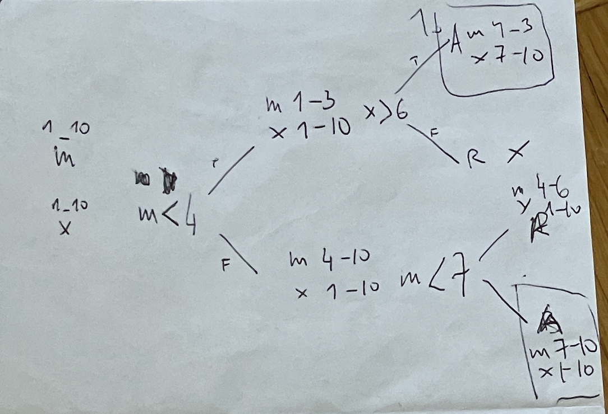

https://adventofcode.com/2023/day/19

[🌟 Day 19 🌟](https://adventofcode.com/2023/day/19)

Re: losing the plot, I was well underway: 

😶‍🌫️

I woke and waited for the countdown on the AoC website and when the seconds reached 0 it didn't open it just showed there are 3 hours left. I had woken up at 3am, I have no idea how that happened (especially as I had gone to bed like one hour before), and then when I actually woke it was a solid hour in 😅

And as the holidays approached there was way more to do, so focus comes in little segments 😢

----

This was a parse fest. 
It's funny seeing the code, and the section dedicated to parsing and the section dedicated to all else.

(again I wrote the write-up with 2 weeks delay, so I had to revisit my code, and try to remember what's up)

#### Thinking process

For Part2 I removed the nestedness of the comparisons, and created a random string & node, this way all the nodes/comparisons were the same, and there was no nested situation. This made it a bit easier as it was a simple travel down the tree party (with recursion).

This was a good simplification of the way I held the data, because in part 1 I kept the nested instructions in their original nested format, which meant that when I was moving around the pieces there had to be extra code that was dealing with the nestedness. 

For part 2 I kept a dictionary with the exisiting min and max values of each XMAS part, that I was copying and updating on each comparison and step.

It took me a little while to understand how the values were to be calculated at the end (as in what gets multiplied together), I think I was multiplying all the correct paths on each step, and not just the nodes. 

I also used paper to help me understand how things work, with an example of like 3 rows and numbers up to 10.

#### Issues

#### Things I thought about afterwards:
