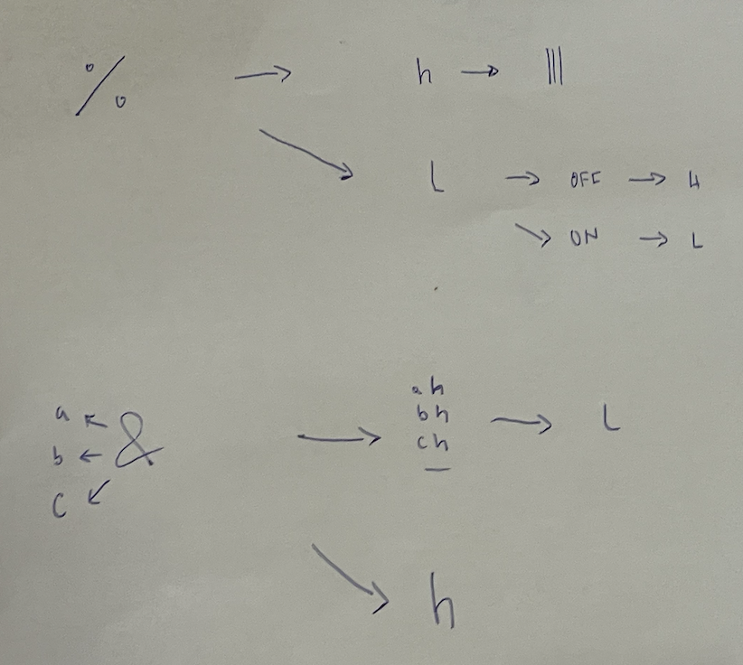
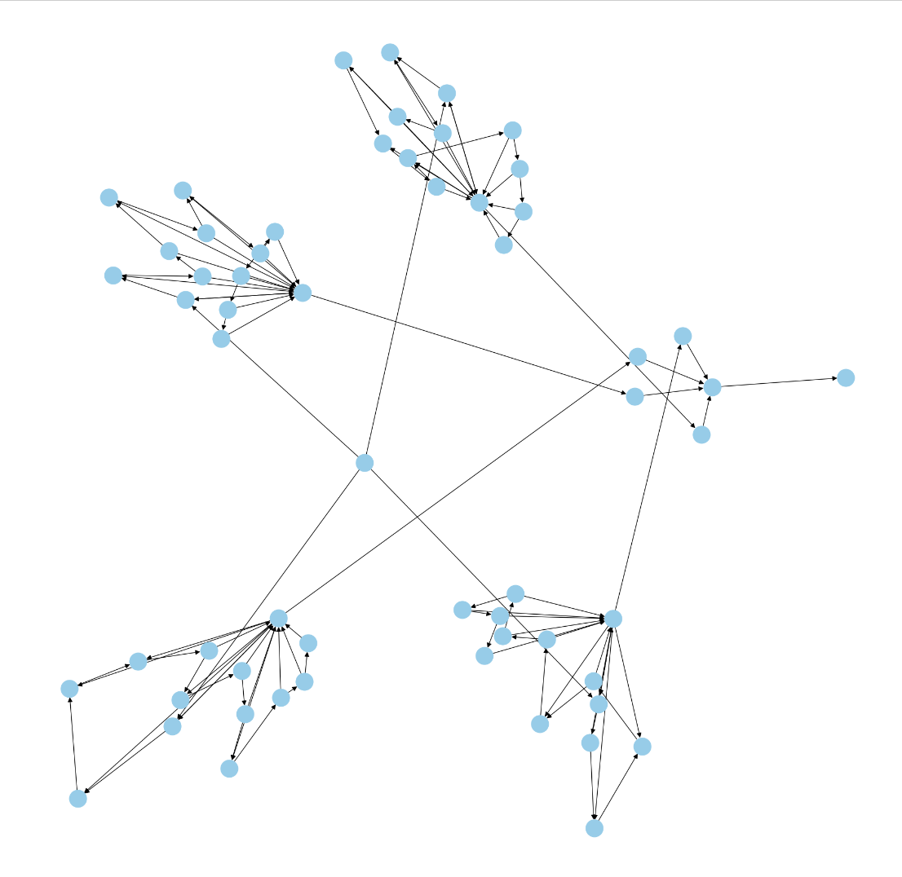
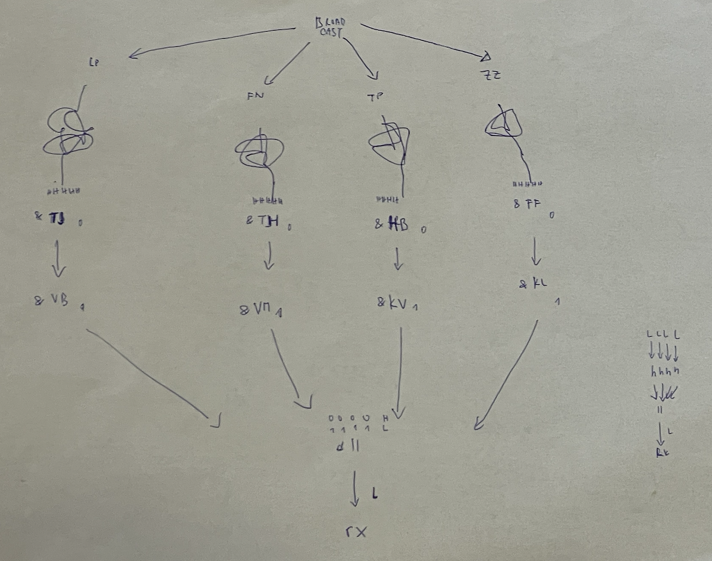

https://adventofcode.com/2023/day/20

[🌟 Day 20 🌟](https://adventofcode.com/2023/day/20)

Advent of (reading)Comprehension is back 🫠
This took quite an effort to read through 🤣 but eventually this was the takeaway:



Also happy 🎂 to my mum! 


#### Thinking process


Part 1: 

Was a translation of the above rules into code. And running it 1000 times while keeping a counter of low and high pulses.


Part 2: 

I was hopeful, but not that hopeful:
```
how long did you wait for your part 2s 🤣
Is it forever?
```


I felt that there was definitely some inspiration to get from the way the data was built, so I tried to visualize it [in a jupyter notebook](graph_out_of_dictionary.ipynb), I think my first iteration had one big blob but maybe by using different libraries or something, eventually I could see the 4 blobs.



Or you lnow, one can make it pretty like this too: 
https://www.reddit.com/r/adventofcode/comments/18mypla/2023_day_20_input_data_plot/


My thinking as I tried to come to a solution (that I then successfully implemented):

There are 4 separate sections of cycles, each getting one input pulse with one output pulse (going to rx through one node). If i understand what the 4 nodes leading to rx need, then I can check when each of the cycles matches the needed output and then do lcm of the values like a few days ago.

Like so: 




#### Issues


#### Things I thought about afterwards:


