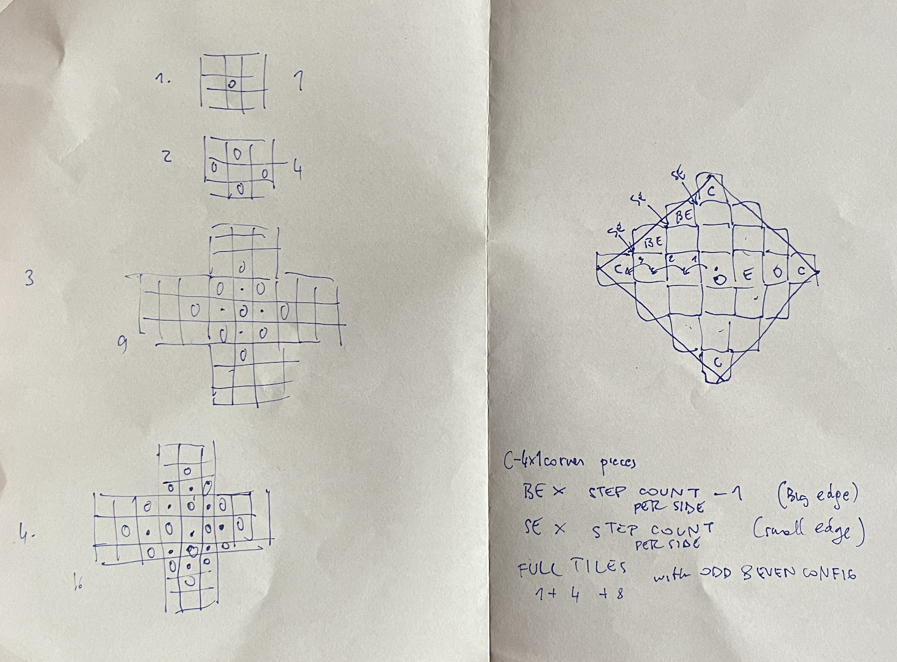

https://adventofcode.com/2023/day/21

[🌟 Day 21 🌟](https://adventofcode.com/2023/day/21)


#### Thinking process


Part 1 was pretty straightforward. Step into available boxes and keep going, count the places that have been stepped on.

Part 2 however...

But upon closer inspection, and quite a few threads of conversations, these were the discoveries. 
- The S is bang in the middle.
- it has an interesting dimond shape of empty spaces
- an empty line straight up/down & left/right from S
- the steps have a romboid nature (because they step out up down left right) and the one that goes straight needs 65 steps to get to the edge (before a new box on the edge gets started)
- Edges are also empty. 

The number of steps 26501365 also tells us some secrets: 
```
(26501365-65)/131 = 202300
```
The dimond gets filled on step 65 (we reach the edge), and from then on it takes 131 (65+1+65) steps to get to the next edge, and that's when a new box starts

Here is the image explaining on the left, how the steps move through the space into endlesness (starting a new iteration of garden). On the right how the already walked bits look like once the fastest elf moving in one direction has reached the outmost edge (small edges, big edges, and all sides).



So in order to get the situation at step 26501365 we need to add up the following garden patches: 
- fully covered odd + 
- fully covered even +
- big edges for the 4 différent sides * stepcount - 1 +
- small edges for the 4 différent sides * stepcount +
- 4 extremes squares

The optimisation was that after two 3 blocksteps (65+131+131) out, we get these above values, and can then calculate for the situations where we go 202300 steps out (which is what that block of code at the top does that gets the number of odd and even boxes, as there are only two configurations of how the steps can be spread out).

To make this happen, one needs a grid only 7 gardens large and 7 tall, and then calculate how the steps look like in all the squares of interest.

----

Even after I had it all laid out the numbers didn't come together, no way.

Something was wrong in how I countesd the even and odd boxes, something was wrong in how I was summing things up, or who knows what. And lets not forget a couple one off errors for good measure. There was less and less day available and a solid reset, either of me or the code would have probably helped. 

I also want to say thanks to the Le Wagon crew here, I got lots of support and people who were awake were helping me think things through and sharing test cases and expected results to help me debug. 

But at the end of the day I wasn't able to finish it before the release of the new puzzle, and I think this does something interesting to the brain, I looked at the new puzzle, but my adrenaline falthered, and I was falling asleep leaving trails of repeating character.

Anyways a few days later with some focus I don't even feel lik I changed much, I just cleaned things up, and well at some point the number that came out was correct. 


#### Issues


#### Things I thought about afterwards:
