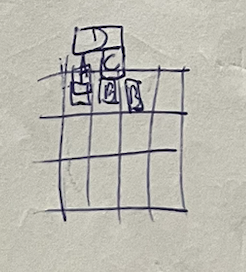
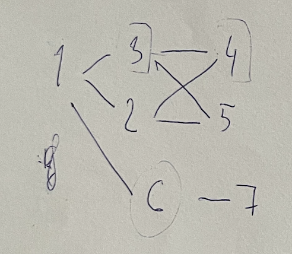
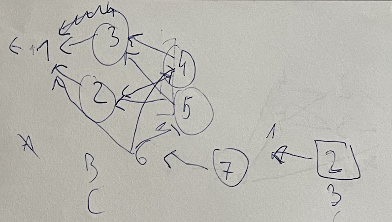

https://adventofcode.com/2023/day/22

[🌟 Day 22 🌟](https://adventofcode.com/2023/day/22)

As 6 am ticked over, and I hadn't been to sleep yet, with the previous day's starts elusive, I knew it's time to take a step back, and accept that

```
I think I am giving up, at least momentarily 🌟 😢 🎄 but will be back for some more later. 🚀

Take care of the stars while until I am back

```
----

This was a fun one

Even though, I, also here, fell pray to unknown ghost issues, when I think this should work - didn't work, and then after some rewrites and cleaning along the I think this should work lines - it then did work. I remember in the previous weeks being quite happy with myself when this should work - often worked - and at first run even sometimes. I feel that at some point through AoC I became less precise, and less careful and less concious, and it was interesting to feel the symptoms on quite a few levels, ghost bugs as one of it too.


#### Thinking process

First I extracted all the coordinates, ordered them by z entry, created a 3D space that I populated with the coordinates. Then I let them all fall to the lowest possible point in 1 step iterations. And if something changed I just moved everything again.

 And of course, there is probably a better way, but when I tried putting the current block with the smallest Z, on top of the current max Z under any point of the block, something wasn't working. So i judt moved on to the other implementation, and hoped I wouldn't stumble across something.


Part 1:

I then went through all the blocks that have fallen all the way to the bottom, and checked the line below it and counted the blocks it's touching. If it touched only one block (even if in more places), then that block can't be disintegrated.

Part 2:

I wrote a milion iterations of the pseudocode of who is supporting who and who needs to support who. 
I don't know why it was so hard to translate that into code (or even in pseudocode), because it feels like a relatively straightforward operation or relationship structure, but I wasn't asking such questions anymore.

At the end: 

I created a dictionary of the elements that each block was holding and was held by (kids and parents in the second part of the code 🤣). And then I used that to see what would disintegrate along with each node (and if after removing the elements to be disintegrated they had no parents, they too were good for disintegration).


Some helpful ilustrations 🤣


An illustration of how the tiles looks like after they have fallen but they look like they've been squished in a corner


Nice, we can see the relationships here, maybe



what relationships? what is this? circle everything! make edges everywhere!?!


#### Issues


#### Things I thought about afterwards: