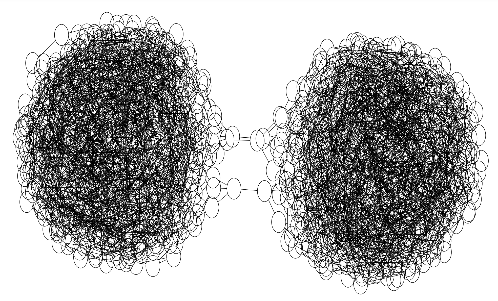

https://adventofcode.com/2023/day/25

[🌟 Day 25 🌟](https://adventofcode.com/2023/day/25)

How painful is that wait, when part one is done, but there is not enough starpower to push the button. 

I was missing about 5 starts, some parts 1 most parts 2 starting from 21, I knew I needed to sit down and focus. I did nibble on them in with tiny pockets of focus, but most of the progress happened in the days after the festivities, when I actually sat down for solid amounts of focus time. Funnily how despite the sleepiness that 6-9am block of time was the most productive especially because focus came undisturbed and incentives onedirectional.

#### Thinking process

I thought that if I manage to display the relationship something will come through.
And it did, the 3 suspect pairs of nodes were very clear. 

After removing the 3 edges, I counted the nodes in each part of the graph.

I used the networkx library for this one, after quite a few mentions of it over the days. It has everything. Who needs to do any kind of DFS/BFS by hand if you have this, well who, the AoC people, that's who.

I also explored a more programmey way of doing this, where one starts at each node, and travels through all the nodes, and the 3 edges most travelled are the ones to remove. But I messed something up, and never got it to work.

Part 2:
A few days later, as I rested a bit, I did 3 stars on one day, and 2 on the next, and then, there they were the 49 stars necessary.

And one more:

🌟

Wow, I manged, 50 stars.

🤝🙌😎🥳

#### Issues

#### Things I thought about afterwards: